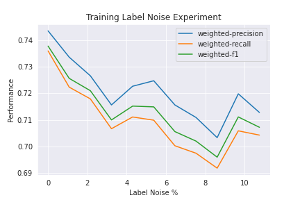
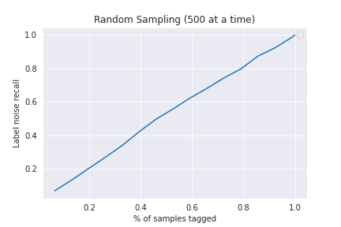

# Introduction

This blog will introduce the label noise problem in our datasets and cover various cleaning methods that can reduce the time taken to fix noisy labels in a dataset

## Classifying causes of intent label noise

It was hard for us to identify why exactly our intent datasets had label noise. So we decided to classify the causes of label noise. After correcting a dataset, we classify the mislabeled instances into a bunch of categories. This allowed us to understand if our intent definitions are bad, or if there were too many cases of multiple intents (our classifier supports only single intents), or if more information is required to understand the right intent (bot speech, previous state values) etc. Here, gold tag refers to the true tag.

| Type                             | Definition                                                                                                                                                                                    |
|----------------------------------|-----------------------------------------------------------------------------------------------------------------------------------------------------------------------------------------------|
| human_error                      | Mistake while tagging. The gold tag is very obvious. This error can also be caused due to poor onboarding/misunderstanding among annotators. Further analysis on these errors maybe required. |
| audio_unclear (perception error) | Unable to understand the intent due to audio noise, low user speech volume, or unable to understand if it's a background speaker or the user speaking, etc.                                   |
| tool_problem                     | Audio could not be played, the problem with tagging interface, audio-clipping issue.                                                                                                          |
| onboarding_error                 | Intent Definition is confusing or bad or incomplete.                                                                                                                                          |
| multiple_intent                  | Audio contains multiple intents - in this case both the noisy and gold intents are correct.                                                                                                   |
| overlapping_intent               | Intent definitions are not mutually exclusive.                                                                                                                                                |
| renamed_intent                   | Intent renamed after guideline changes. This is not exactly a tagging error, but it’s helpful to capture changes.                                                                             |
| missing_context                  | Impossible to understand the intent unless more information is provided (bot prompt or previous state etc.)                                                                                   |
| wrong_retag                      | The new label after re-tagging is wrong. This is not a cause but it allows to capture confusing intents after rechecks.                                                                                                                                                      |

# Why fix label noise?

Test sets should be clean as they serve as a benchmark to take further decision and we depend on those numbers. To measure impact of label noise in train sets, we plot a graph of model perfomance vs increase in % label noise. For this experiment, we retagged an old dataset in one of our clients with thorough reviews to fix most mislabeled examples. The total label noise % came up to 13% of the entire dataset of (7591 instances). To plot this graph, we took the gold dataset and increasingly flipped the  labels to their noisy counterpart and trained a model on the new dataset and plot their performance.

## Impact of train set label noise on model performance 

In the above graph. we pbserve that at 0% label noise, the model performance is around 73.8% F1 and at ~13% label noise, the model performance drops to 70.8% F1. 

# Minimizing tagging errors at source

Here are some recommendations we found useful to prevent future tagging noise.

* Proper onboarding session + 1-2 review sessions *with the annotators*

* Tagging Guidelines
    [add info on mutual exclusivity and supporting tags, tradeoff between complexity and number of tags]

* Examples for exceptional cases - Tracking these would be helpful for designing/modifying intent definitions in the future. [add examples]

* Inter-annotator agreement type tagging is helpful for long-term test sets. Test sets serve as metrics for future plans and hence should have no label noise. Set up separate tog jobs for every annotator (2-3). Each instance would eventually get X tags (X is the number of annotators). [add reference]

# Different cleaning methods to fix label noise in train sets

## Random Sampling
Here we can sample some fixed number of instances and get them retagged. The label noise we capture will be around 13% of each partial sample, and hence the recall will be the fraction of the partial sample (in the whole). On average, the plot will look similar to y=x, like this one for our dataset:

## Biased Sampling
This requires intermittent involvement from ops (tagging after every sampling iteration)

In this method, we first randomly retag x % of samples. Then we identify the major tag confusions (as shown in the Dataset section) and pick the top 5 noisy tags and increase the weights associated to these tags in the sampling function. Then we sample again - pick top 5 tags - repeat.

We see an improvement over the baseline. We can capture around 60% of the total label noise by just tagging around 32% of the total dataset by this heuristic.

## Datamaps
We leverage the training artefacts from data maps to define a label score for each sample - as the Euclidean distance between (0,0) and (confidence, variability). Following the hypothesis of hard-to-learn regions, we expect noisy samples to have a lower label score.
* **Threshold on label-score** \
  Fixing a threshold on the label score means that all samples that score below it are considered label noise, and those that score above are considered clean. Assuming we do Human Retagging of all samples predicted as label noisy, fixing a threshold essentially fixes both the % of samples retagged and (given the clean tags-) label noise recall. Varying the threshold, we get a plot for our dataset:

  
  Looking at our metrics, we see an improvement in the partial recleaning process.
  Lets read the above plots. Say we fix the threshold at 0.43 which means we would be retagging around 28% of our dataset. This corresponds to a label noise recall of 60%, giving us a resulting dataset with 5.2% label noise from 13%. (= 0.40*13).

* **n-consecutive correct instances** \
  Here, we will use the ordering of the label scores. Note that this is an extension of the original HTL hypothesis on Data Maps - which creates partitions based on only thresholds (on the training artefacts - confidence, variability). Our added assumption here, is that the ordering within the regions are also useful.
  Based on this, we sort our samples by label score, and in ascending order. This means the noisy samples should be nearer to the top, and we base our heuristic on this. We start Human Retagging from the top of the sorted list of samples, and stop once we see N-consecutive clean samples. Note how different this is from anything we have done before - because we are combining the Human Retagging process into the label noise id one.\
  Varying N, we get a plot for our dataset:

  
  Again, we see an improvement in the partial recleaning process. Lets read the above plots. Say we fix N at ~38, which means we would be retagging around 35% of our dataset. This corresponds to a corresponds to a label noise recall of 60%, which means we would capture and clean 76% of the label noise. Giving us a resulting dataset with 3.1% label noise (= (1-0.76)*0.13).

## Cleanlab

This is a label noise prediction tool. We have evaluated the accuracy of this tool instead. But we won’t be able to capture all the noisy labels via this tool. This tool takes in predicted probabilities

### Confident Learning

Confident Learning high level idea - When the predicted probability of an example is greater than a per-class-threshold, we confidently count that example as actually belonging to that threshold’s class. The thresholds for each class are the average predicted probability of examples in that class. 

Confident Learning estimates a joint distribution between noisy observed labels and the true latent labels. It assumes that the predicted probabilities are out-of-sample holdout probabilities (eg. K-fold cross validation). If this isn't the case then overfitting may occur. Their algorithm also assumes that class-conditional label noise transitions are data independent.

Metrics using a model trained on noisy labels

Results are generated using the `get_noise_indices()` method

Tested on a test set

|                                                                                                                            | precision | recall | f1-score | support |
|----------------------------------------------------------------------------------------------------------------------------|-----------|--------|----------|---------|
| wrong_tag_inscope                                                                                                          | 0.22      | 0.59   | 0.32     | 99      |
| wrong_tag_oos                                                                                                              | 0.55      | 0.63   | 0.59     | 136     |
| wrong_tags_aoos                                                                                                            | 0.27      | 0.59   | 0.37     | 99      |

Results are slightly better when the model is trained on clean data

|                                                                                                                            | precision | recall | f1-score | support |
|----------------------------------------------------------------------------------------------------------------------------|-----------|--------|----------|---------|
| wrong_tag_inscope                                                                                                          | 0.25      | 0.71   | 0.37     | 99      |
| wrong_tag_oos                                                                                                              | 0.58      | 0.72   | 0.64     | 136     |
| wrong_tags_aoos                                                                                                            | 0.30      | 0.69   | 0.42     | 99      |

We expect cleanlab to perform even better once our model test accuracies improve.

# References

