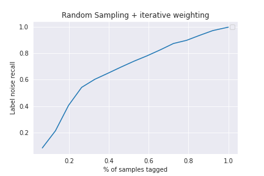
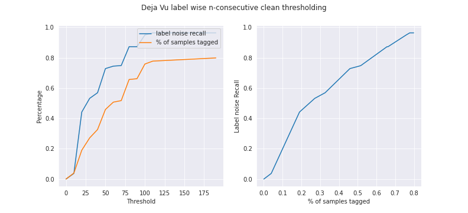

## Introduction

Label noise has been a consistent problem even in the [most widely used open source datasets](https://datasets-benchmarks-proceedings.neurips.cc/paper/2021/file/f2217062e9a397a1dca429e7d70bc6ca-Paper-round1.pdf). Several papers have come up various [deep learning techniques](https://arxiv.org/pdf/2007.08199.pdf) to make models more robust to label noise present in their train sets. Even so, identifying label noise in your dataset and investigating it's cause is an important process to further understand model behaviour and prevent label noise in future datasets. 

In this blog, we discuss why we decided to fix label noise in our datasets followed by some statistic cleaning methods we tested to narrow down regions within the dataset where label noise could be present.

## Why fix label noise?

Test sets should be clean to serve as a benchmark for future decisions. To measure the impact of noisy train sets, we plot a graph of model performance versus % label noise. To conduct this experiment, we retagged an old dataset in one of our clients and thoroughly reviewed it to identify and fix mislabelled examples. The total number of mislabelled examples was 13% of the whole dataset (7591 instances). We flipped the gold labels into their noisy counterparts, trained a model on the newly formed dataset and plotted the results.

### Impact of train set label noise on our model performance 

In the above graph. we pbserve that at 0% label noise, the model performance is around 73.8% F1 and at ~13% label noise, the model performance drops to 70.8% F1.

## Different cleaning methods to fix the label noise

By measuring the reduction in cleaning effort from the baseline, we can assess the efficacy of the cleaning method. We plotted label noise recall vs % of samples retagged (or annotator effort) - Relating these metrics with previous impact graph allows us to reach interesting conclusions like - *clean y% of the dataset using a method M, and you will get some x% bump in model performance*. 

### Random Sampling
Here we can sample some fixed number of instances and get them retagged. This serves as our baseline for other methods. The label noise we capture will be around 13% of each partial sample, and hence the recall will be the fraction of the partial sample (in the whole). On average, the plot will look similar to y=x, like this one for our dataset:

### Biased Sampling
This requires intermittent involvement from ops (tagging after every sampling iteration)

In this method, we first randomly retag x % of samples. Then we identify the major tag confusions (as shown in the Dataset section) and pick the top 5 noisy tags and increase the weights associated to these tags in the sampling function. Then we sample again - pick top 5 tags - repeat.

We see an improvement over the baseline. We can capture around 60% of the total label noise by just tagging around 32% of the total dataset by this heuristic.

### Datamaps

[This](https://arxiv.org/pdf/2009.10795.pdf) paper introduces datamaps - a tool to diagnose training sets during the training process itself. They introduce two metrics - confidence and variability to understand training dynamics. They further plot each instance on a confience vs variability graph and create hard-to-learn, ambigous and easy regions. These regions correspond to how easy it is for the model to learn the particular instance. They also observe that the hard-to-learn regions also corresponded instances that had label noise. 

*Confidence* - This is defined as the mean model probability of the true label across epochs.\
*Variability* - This measures the spread of model probability across epochs, using the standard deviation.

The intuition is that instances with consistently lower confidence scores throughout the training process are hard for a model to learn. This could be because the model is not capable of learning the target label or that the target label was incorrect.

We leverage the training artefacts from the paper to define a label score for each sample - as the Euclidean distance between (0,0) and (confidence, variability). Following the hypothesis of hard-to-learn regions, we expect noisy samples to have a lower label score.
* **Threshold on label-score** \
  Fixing a threshold on the label score means that all samples that score below it are considered label noise, and those that score above are considered clean. Assuming we do Human Retagging of all samples predicted as label noisy, fixing a threshold essentially fixes both the % of samples retagged and (given the clean tags-) label noise recall. Varying the threshold, we get a plot for our dataset:

  
  Looking at our metrics, we see an improvement in the partial recleaning process.
  Lets read the above plots. Say we fix the threshold at 0.43 which means we would be retagging around 28% of our dataset. This corresponds to a label noise recall of 60%, giving us a resulting dataset with 5.2% label noise from 13%. (= 0.40*13).

* **n-consecutive correct instances** \
  Here, we will use the ordering of the label scores. Our added assumption here, is that the ordering within the regions are also useful. Based on this, we sort our samples by label score, and in ascending order. This means the noisy samples should be nearer to the top, and we base our heuristic on this. We start Human Retagging from the top of the sorted list of samples, and stop once we see N-consecutive clean samples.
  Varying N, we get a plot for our dataset:

  \
  Again, we see an improvement in the partial recleaning process. Lets read the above plots. Say we fix N at ~38, which means we would be retagging around 35% of our dataset. This corresponds to a corresponds to a label noise recall of 60%, which means we would capture and clean 76% of the label noise. Giving us a resulting dataset with 3.1% label noise (= (1-0.76)*0.13).

### Cleanlab

This is a label noise prediction tool. We have evaluated the accuracy of this tool instead. But we won’t be able to capture all the noisy labels via this tool. This tool takes in predicted probabilities. Since cleanlab depends on output model probabilities it can't be used to correct train sets.

### Confident Learning

Confident Learning high level idea - When the predicted probability of an example is greater than a per-class-threshold, we confidently count that example as actually belonging to that threshold’s class. The thresholds for each class are the average predicted probability of examples in that class. 

Confident Learning estimates a joint distribution between noisy observed labels and the true latent labels. It assumes that the predicted probabilities are out-of-sample holdout probabilities (eg. K-fold cross validation). If this isn't the case then overfitting may occur. Their algorithm also assumes that class-conditional label noise transitions are data independent.

Metrics using a model trained on noisy labels.

Tested on a separate test set

|                                                                                                                            | precision | recall | f1-score | support |
|----------------------------------------------------------------------------------------------------------------------------|-----------|--------|----------|---------|
| wrong_tag_inscope                                                                                                          | 0.22      | 0.59   | 0.32     | 99      |
| wrong_tag_oos                                                                                                              | 0.55      | 0.63   | 0.59     | 136     |
| wrong_tags_aoos                                                                                                            | 0.27      | 0.59   | 0.37     | 99      |

Results are slightly better when the model is trained on clean data

|                                                                                                                            | precision | recall | f1-score | support |
|----------------------------------------------------------------------------------------------------------------------------|-----------|--------|----------|---------|
| wrong_tag_inscope                                                                                                          | 0.25      | 0.71   | 0.37     | 99      |
| wrong_tag_oos                                                                                                              | 0.58      | 0.72   | 0.64     | 136     |
| wrong_tags_aoos                                                                                                            | 0.30      | 0.69   | 0.42     | 99      |

We expect cleanlab to perform even better once our model test accuracies improve. Cleanlab wont be very useful if the model is performing poorly even on a clean dataset.

## Minimizing tagging errors at source

To understand why our datasets had noisy labels, we conducted several review sessions with our annotators after they retagged datasets across multiple clients. We further classified each mislabelled example into a list of possible reasons as shown below. Here, gold tag refers to the ground truth tag. Each instance was tagged X times (X is the number of annotators) and the highest tag was chosen as the correct tag.

| Type                             | Definition                                                                                                                                                                                    |
|----------------------------------|-----------------------------------------------------------------------------------------------------------------------------------------------------------------------------------------------|
| human_error                      | Mistake while tagging. The gold tag is very obvious. This error can also be caused due to poor onboarding/misunderstanding among annotators. Further analysis on these errors maybe required. |
| audio_unclear (perception error) | Unable to understand the intent due to audio noise, low user speech volume, or unable to understand if it's a background speaker or the user speaking, etc.                                   |
| tool_problem                     | Audio could not be played, the problem with tagging interface, audio-clipping issue.                                                                                                          |
| onboarding_error                 | Intent Definition is confusing or bad or incomplete.                                                                                                                                          |
| multiple_intent*                  | Audio contains multiple intents - in this case both the noisy and gold intents are correct.                                                                                                   |
| overlapping_intent               | Intent definitions are not mutually exclusive.                                                                                                                                                |
| renamed_intent                   | Intent renamed after guideline changes. This is not exactly a tagging error, but it’s helpful to capture changes.                                                                             |
| missing_context                  | Impossible to understand the intent unless more information is provided (bot prompt or previous state etc.)                                                                                   |
| wrong_retag                      | The new label after re-tagging is wrong. This is not a cause but it allows to capture confusing intents after rechecks.                                                                                                                                                      |
* since our intent classifiers were not multi-label, we wanted to capture the total % of multiple intent scenarios.

We observed that the label noise patterns for each of our clients were quite different, which made the problem of generalizing label noise prediction even more difficult.

## Conclusion

To conclude, we quantified how using datamaps helps in reducing effort taken to clean our existing train sets. We also correlated this reduced cleaning effort with the expected improvement in model performance with the help of some plots.

